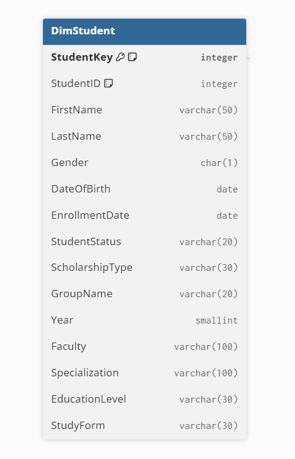
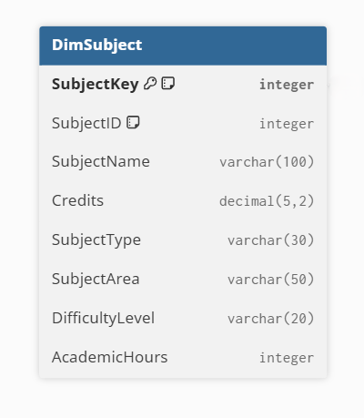
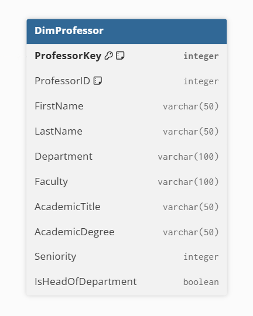
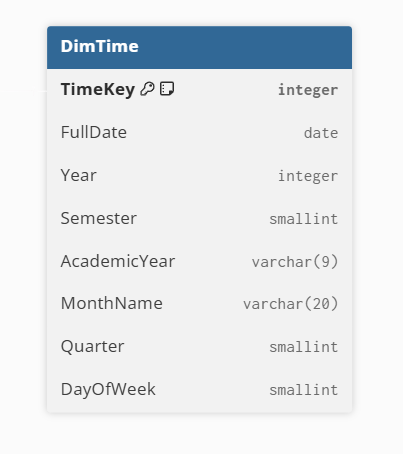
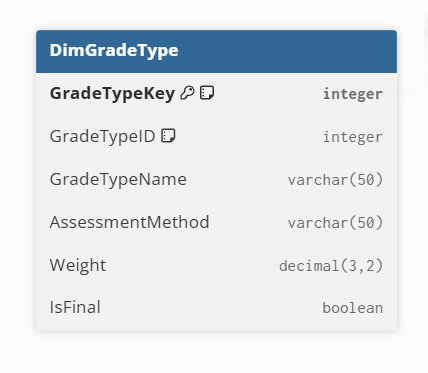
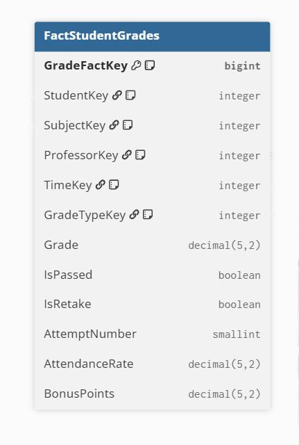
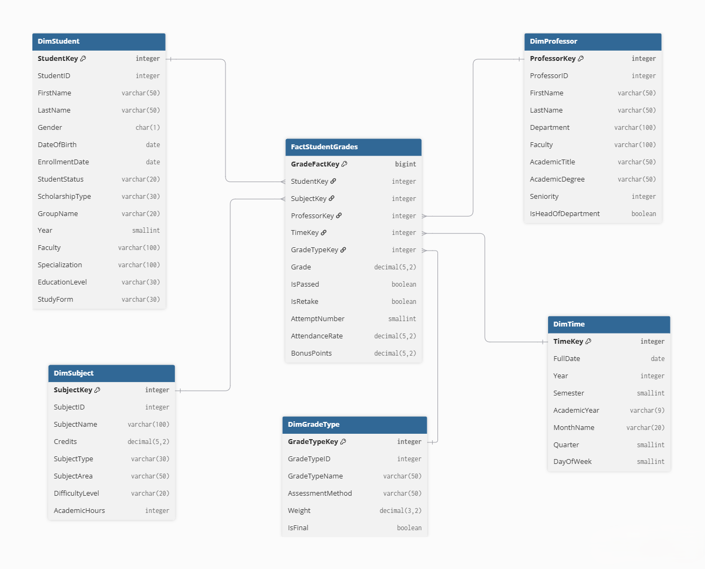

# Домашнее задание №5: Проектирование хранилища данных (Data Warehouse)

## Тема: Система высшего образования

---

## 1. Выбор бизнес-процесса

### 1.1. Бизнес-процесс

Выбран бизнес-процесс: **«Анализ успеваемости студентов»**

### 1.2. Причина выбора

Данный процесс выбран потому что успеваемость студентов это основной показатель качества образования, успеваемость зависит от множества факторов, что делает ее идеальным объектом для анализа. Также результаты анализа помогают принимать решения по управлению высшим учебным заведением (пересмотр учебых программ, увеличение или уменьшение бюджетных мест и т.д.).

### 1.3. Ключевые бизнес-вопросы

1. Какие факультеты показывают лучшую успеваемость
2. Какие предметы вызывают наибольшую трудность
3. Какие преподаватели имеют лучший.худший результат
4. Как меняется успеваемость между семестрами
5. Какие студенты имеют лучшую/худшую успеваемость
6. Расчет стипендий
7. Список студентов, которые находятся на грани отчисления
8. Средний балл по вузу
9. Процент сдавших экзамен
10. Процент оттчисленных

## 2. Уровень детализации (Grain)

Одна строка факта = одна итоговая оценка конкретного студента по конкретному предмету у конкретного преподавателя за конкретный семестр.

## 3. Таблицы измерений

### 3.1. DimStudent (Кто?)

**Назначение:** Хранит информацию о студенте

### 3.2. DimSubject (Что?)

**Назначение:** Хранит информацию об учебных предметах

### 3.3. DimProfessor (Кто преподает?)

**Назначение:** Хранит информацию о преподавателях.

### 3.4. DimTime (Когда?)

**Назначение:** Измерение для понимания как менялась усппеваемость студента в разных семестрах, годах; сранвить результаты студентов, которые учатся сейчас с теми, которые учислиь раньше.

### 3.5. DimGradeType (Как оценивали?)

**Назначение:** Классифицирует оценки по типу (экзамен/зачет/курсовая) и методу оценивания (тестирование/устный ответ/проект).

## 4. Таблица фактов

### 4.1. FactStudentGrades

**Назначение:** Хранит фактические данные об успеваемости студентов.

## 5. Диаграмма (схема "Звезда")

