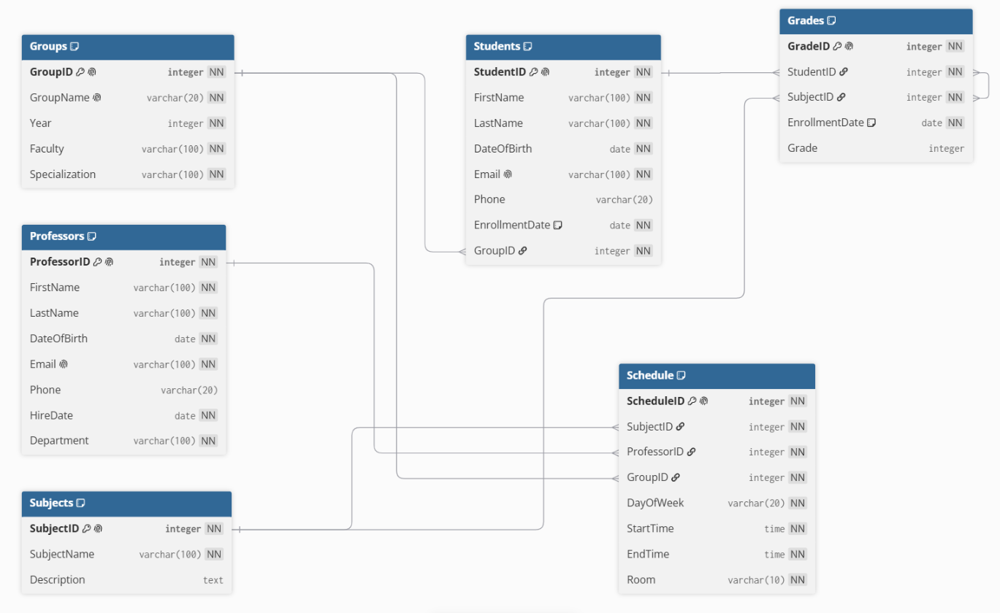

# Отчёт по домашнему заданию №2: Проектирование базы данных для системы высшего образования

---

## Part 1. Выбор сценария

Для данной работы выбран сценарий: **Система высшего образования**.  
Эта система будет управлять данными о студентах, преподавателях, учебных группах, предметах, расписании занятий и успеваемости.

---

## Part 2. Проектирование базы данных и документация

### Идентификация сущностей и атрибутов

1. **Students** – студенты (личные данные, контакты, группа)
2. **Professors** – преподаватели (личные данные, кафедра)
3. **Groups** – учебные группы (номер, курс, факультет, специальность)
4. **Subjects** – учебные предметы (название, описание)
5. **Schedule** – расписание (привязка предмета к преподавателю, группе, дню, времени, аудитории)
6. **Grades** – успеваемость (связь студента с предметом, дата зачисления, оценка)

---

### Проектирование таблиц

#### 1. Table Name: Students

**Description:** Хранит личную информацию о студентах.

**Attributes:**
- `StudentID`: INTEGER, PK, NOT NULL
- `FirstName`: VARCHAR(100), NOT NULL
- `LastName`: VARCHAR(100), NOT NULL
- `DateOfBirth`: DATE, NOT NULL
- `Email`: VARCHAR(100), UNIQUE, NOT NULL
- `Phone`: VARCHAR(20)
- `EnrollmentDate`: DATE, NOT NULL, DEFAULT CURRENT_DATE
- `GroupID`: INTEGER, FK (REFERENCES Groups), NOT NULL

**Constraints:**
- `PK_Students`: PRIMARY KEY (StudentID)
- `UQ_StudentEmail`: UNIQUE (Email)
- `CHK_EnrollmentDate`: CHECK (EnrollmentDate <= CURRENT_DATE)
- `FK_Students_Groups`: FOREIGN KEY (GroupID) REFERENCES Groups(GroupID)

---

#### 2. Table Name: Professors

**Description:** Хранит данные о преподавателях.

**Attributes:**
- `ProfessorID`: INTEGER, PK, NOT NULL
- `FirstName`: VARCHAR(100), NOT NULL
- `LastName`: VARCHAR(100), NOT NULL
- `DateOfBirth`: DATE, NOT NULL
- `Email`: VARCHAR(100), UNIQUE, NOT NULL
- `Phone`: VARCHAR(20)
- `HireDate`: DATE, NOT NULL
- `Department`: VARCHAR(100), NOT NULL

**Constraints:**
- `PK_Professors`: PRIMARY KEY (ProfessorID)
- `UQ_ProfessorEmail`: UNIQUE (Email)
- `CHK_HireDate`: CHECK (HireDate <= CURRENT_DATE)

---

#### 3. Table Name: Groups

**Description:** Хранит информацию об учебных группах.

**Attributes:**
- `GroupID`: INTEGER, PK, NOT NULL
- `GroupName`: VARCHAR(20), NOT NULL, UNIQUE
- `Year`: INTEGER, NOT NULL, CHECK (Year BETWEEN 1 AND 6)
- `Faculty`: VARCHAR(100), NOT NULL
- `Specialization`: VARCHAR(100), NOT NULL

**Constraints:**
- `PK_Groups`: PRIMARY KEY (GroupID)
- `UQ_GroupName`: UNIQUE (GroupName)
- `CHK_Year`: CHECK (Year >= 1 AND Year <= 6)

---

#### 4. Table Name: Subjects

**Description:** Хранит информацию об учебных предметах.

**Attributes:**
- `SubjectID`: INTEGER, PK, NOT NULL
- `SubjectName`: VARCHAR(100), NOT NULL
- `Description`: TEXT

**Constraints:**
- `PK_Subjects`: PRIMARY KEY (SubjectID)
- `UQ_SubjectName`: UNIQUE (SubjectName)  *(добавлено ограничение)*

---

#### 5. Table Name: Schedule

**Description:** Хранит расписание занятий. Каждый предмет может иметь несколько занятий (лекции, практики) в разные дни и время.

**Attributes:**
- `ScheduleID`: INTEGER, PK, NOT NULL
- `SubjectID`: INTEGER, FK (REFERENCES Subjects), NOT NULL
- `ProfessorID`: INTEGER, FK (REFERENCES Professors), NOT NULL
- `GroupID`: INTEGER, FK (REFERENCES Groups), NOT NULL
- `DayOfWeek`: VARCHAR(20), NOT NULL
- `StartTime`: TIME, NOT NULL
- `EndTime`: TIME, NOT NULL
- `Room`: VARCHAR(10), NOT NULL

**Constraints:**
- `PK_Schedule`: PRIMARY KEY (ScheduleID)
- `FK_Schedule_Subjects`: FOREIGN KEY (SubjectID) REFERENCES Subjects(SubjectID)
- `FK_Schedule_Professors`: FOREIGN KEY (ProfessorID) REFERENCES Professors(ProfessorID)
- `FK_Schedule_Groups`: FOREIGN KEY (GroupID) REFERENCES Groups(GroupID)
- `CHK_Time`: CHECK (StartTime < EndTime)
- `UQ_RoomTime`: UNIQUE (Room, DayOfWeek, StartTime)

---

#### 6. Table Name: Grades

**Description:** Хранит информацию об успеваемости (связь многие-ко-многим между студентами и предметами). Оценка выставляется по 10‑балльной шкале (от 1 до 10), NULL – если ещё не выставлена.

**Attributes:**
- `GradeID`: INTEGER, PK, NOT NULL
- `StudentID`: INTEGER, FK (REFERENCES Students), NOT NULL
- `SubjectID`: INTEGER, FK (REFERENCES Subjects), NOT NULL
- `EnrollmentDate`: DATE, NOT NULL, DEFAULT CURRENT_DATE
- `Grade`: INTEGER, CHECK (Grade BETWEEN 1 AND 10) – NULL допустимо

**Constraints:**
- `PK_Grades`: PRIMARY KEY (GradeID)
- `FK_Grades_Students`: FOREIGN KEY (StudentID) REFERENCES Students(StudentID) ON DELETE CASCADE
- `FK_Grades_Subjects`: FOREIGN KEY (SubjectID) REFERENCES Subjects(SubjectID) ON DELETE CASCADE
- `UQ_StudentSubject`: UNIQUE (StudentID, SubjectID)
- `CHK_Grade`: CHECK (Grade >= 1 AND Grade <= 10)

---

### Взаимосвязи (Relationships)

1. **Groups – Students (Один-ко-многим)**  
   Одна группа может содержать множество студентов, но каждый студент принадлежит ровно одной группе.  
   **Реализация:** `Students.GroupID` является внешним ключом, ссылающимся на `Groups.GroupID`.

2. **Professors – Schedule (Один-ко-многим)**  
   Один преподаватель может вести множество занятий, но каждое занятие проводится одним преподавателем.  
   **Реализация:** `Schedule.ProfessorID` является внешним ключом, ссылающимся на `Professors.ProfessorID`.

3. **Groups – Schedule (Один-ко-многим)**  
   Для одной группы составляется множество занятий, но каждое занятие привязано к одной группе.  
   **Реализация:** `Schedule.GroupID` является внешним ключом, ссылающимся на `Groups.GroupID`.

4. **Subjects – Schedule (Один-ко-многим)**  
   Один предмет может иметь несколько занятий (лекции, практики), но каждое занятие относится к одному предмету.  
   **Реализация:** `Schedule.SubjectID` является внешним ключом, ссылающимся на `Subjects.SubjectID`.

5. **Students – Grades (Один-ко-многим)**  
   Один студент может иметь множество записей об успеваемости (по разным предметам), но каждая запись принадлежит одному студенту.  
   **Реализация:** `Grades.StudentID` является внешним ключом, ссылающимся на `Students.StudentID`.

6. **Subjects – Grades (Один-ко-многим)**  
   Один предмет может иметь множество записей об успеваемости (от разных студентов), но каждая запись относится к одному предмету.  
   **Реализация:** `Grades.SubjectID` является внешним ключом, ссылающимся на `Subjects.SubjectID`.

7. **Students – Subjects (Многие-ко-многим)** – эта связь реализована через промежуточную таблицу `Grades`.  
   Студент может изучать множество предметов, и каждый предмет может изучаться множеством студентов.  
   **Реализация:** в таблице `Grades` поля `StudentID` и `SubjectID` являются внешними ключами, которые вместе образуют связь многие-ко-многим.

---

## Part 3. ER-диаграмма

